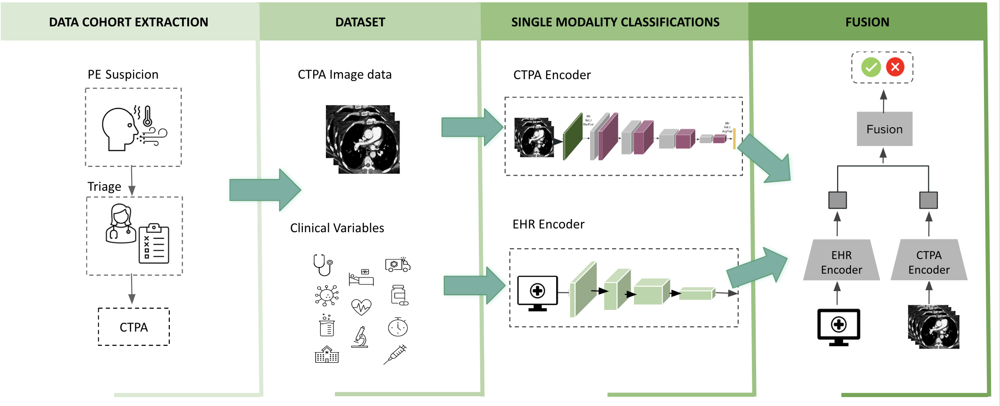
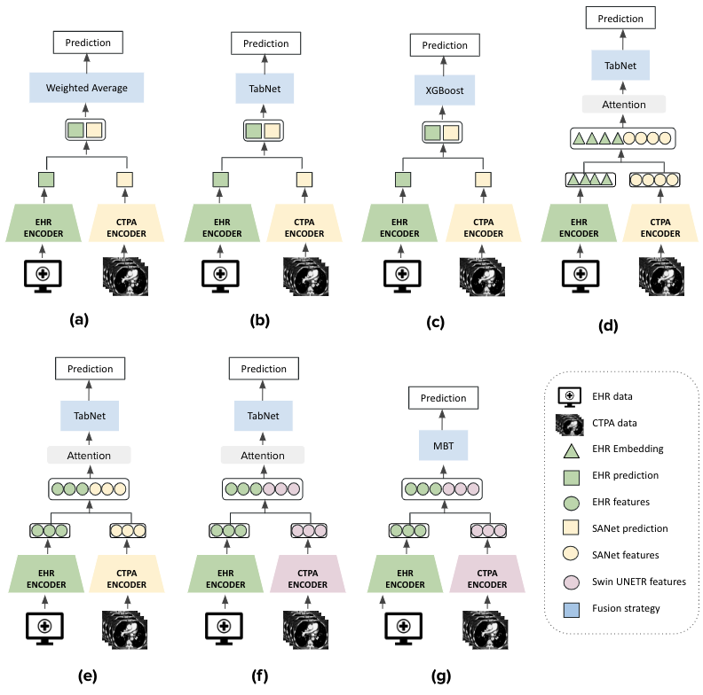
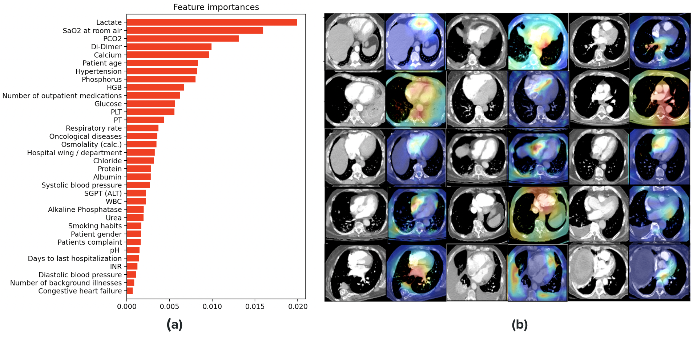

# Multimodal Fusion Models for PE Mortality Prediction

This repository contains the scripts and models used in the paper *"Multimodal Fusion Models for Pulmonary Embolism Mortality Prediction"* published on Scientific Reports. [manuscript link](https://www.nature.com/articles/s41598-023-34303-8)

## Table of Contents
0. [Introduction](#introduction)
0. [Results](#results)
0. [Citation](#citation)
0. [Data Availability](#data-availability)
0. [Usage](#usage)

## Introduction 

Pulmonary embolism (PE) is a common, life-threatening cardiovascular emergency. 
Risk stratification is one of the core principles of acute PE management and determines the choice of diagnostic and therapeutic strategies. 
In routine clinical practice, clinicians rely on the patient’s electronic health record (EHR) to provide a context for their medical imaging interpretation. Most deep learning models for radiology applications only consider pixel-value information without the clinical context. The workflow for this study is presented below: 

We develop and compare multimodal fusion models that can utilize multimodal data by combining (1) CTPA imaging and (2) EHR tabular data on demographics, co-morbidities, vital signs, laboratory results and clinical scores for PE severity assessment. 
 
We tested early, late and intermediate fusion strategies, using different architectures and compared their performance to better leverage the various data modalities.

 

## Results

We evaluated the contribution of both single and multimodality classifiers. The results show that this multimodal learning method boosts prediction metrics and outperforms single modality classification networks. Model performance on the held-out testset with 95% confidence intervals for the AUC. These thresholds were determined by Youden's index, which finds the optimal joint sensitivity and specificity:

|    Model    |       AUC       | Accuracy | Specificity | Sensitivity |
|-------------|-----------------|----------|-------------|-------------|
|CTPA model   |0.82 [0.74-0.91] | 0.79     | 0.79        |   0.8       |
|EHR model    |0.87 [0.78-0.95] | 0.81     | 0.79        |   0.9       |
|PESI         |0.78 [0.7-0.87]  | 0.49     | 0.4         |   0.9       |
|sPESI        |0.79 [0.72-0.87] | 0.38     | 0.36        |   0.9       |
|Fusion model |0.96 [0.93-1.0]  | 0.93     | 0.94        |   0.9       |

To introduce model interpretability and facilitate subsequent clinical applications, we highlight the image regions and tabular features that our model uses for prediction:

## Citation
If you use any of our code, please cite:

	@article{Cahan2023,
            title={Multimodal fusion models for pulmonary embolism mortality prediction},
            author={Cahan, Noa and Klang, Eyal and Marom, Edith M. and Soffer, Shelly and Barash, Yiftach and Burshtein, Evyatar and Konen, Eli and Greenspan, Hayit},
            journal={Scientific Reports},
            year={2023},
            month={May},
            day={09},
            volume={13},
            number={1},
            pages={7544},
            issn={2045-2322},
            doi={10.1038/s41598-023-34303-8},
            url={https://doi.org/10.1038/s41598-023-34303-8}
            }

## Data Availability

The datasets generated and analyzed during this study are not currently publicly available due to patient privacy regulations.

## Usage

### Training

1. To train the model, please modify the default parameters in `settings.py` file or feed them as arguments in the command line.
2. Run `train.py`. Training logs can be seen or altered using TensorBoard. 
3. Running `train.py --help` will display all available options and parameters for the run.

### Testing and analyzing results

1. To test a trained model, please set the **pretrain_path** and **model_type** parameters in `settings.py` file or feed them as a command line argument.
2. Run `test.py`. This will create a folder with the prediction probabilities as well as the embeddings of the test set.
3. Run `analyze_predictions.py` to produce all test related metrics.

